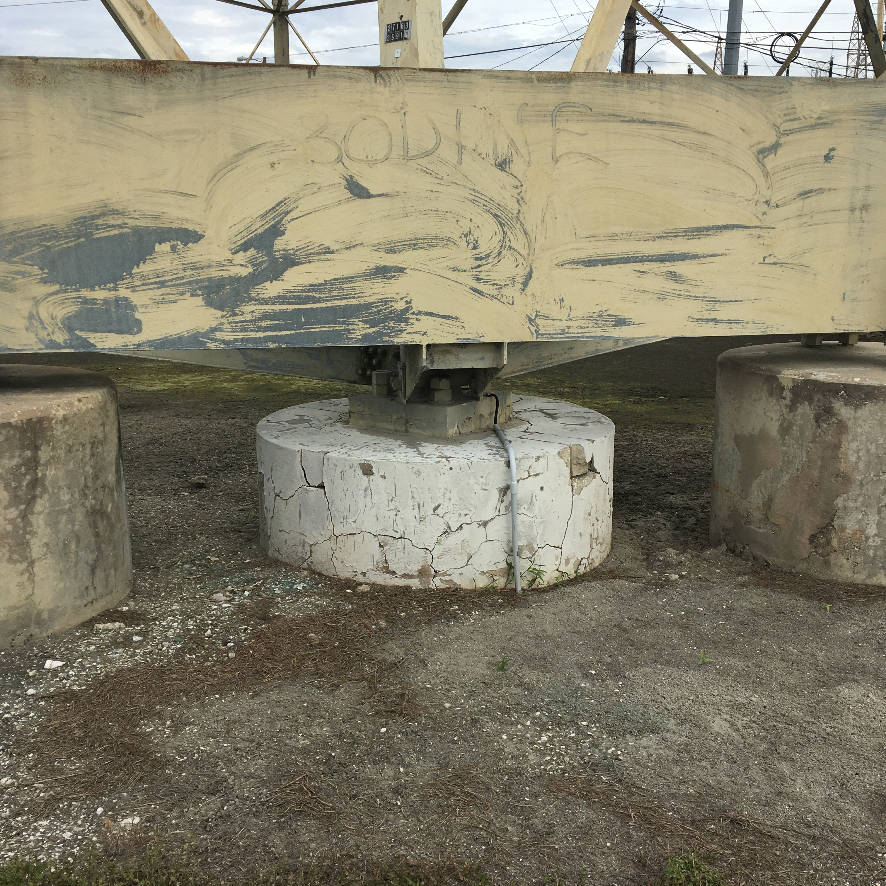
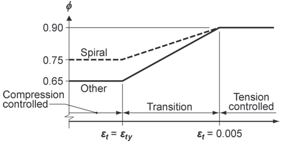
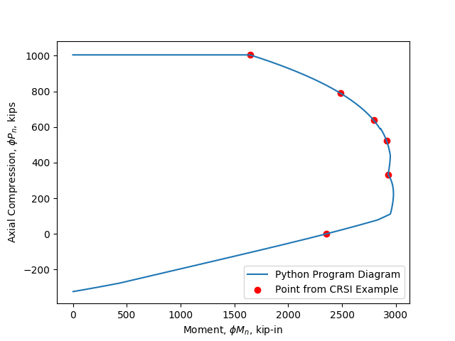
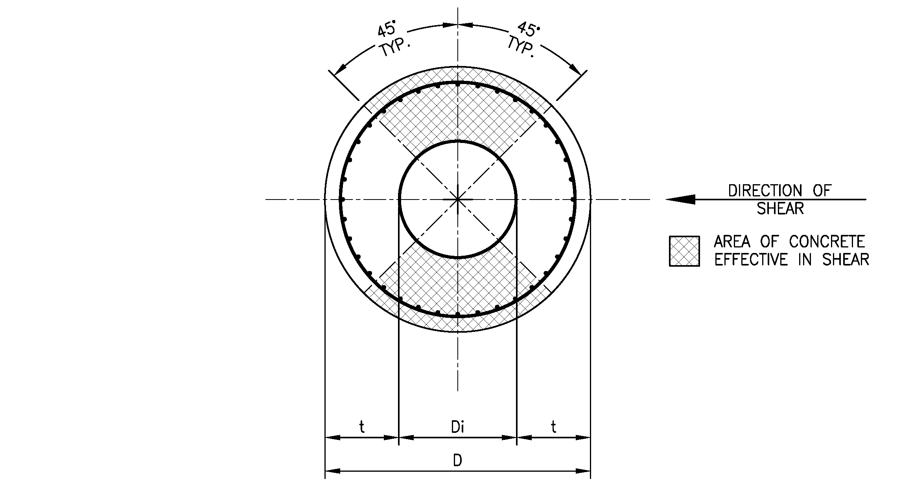
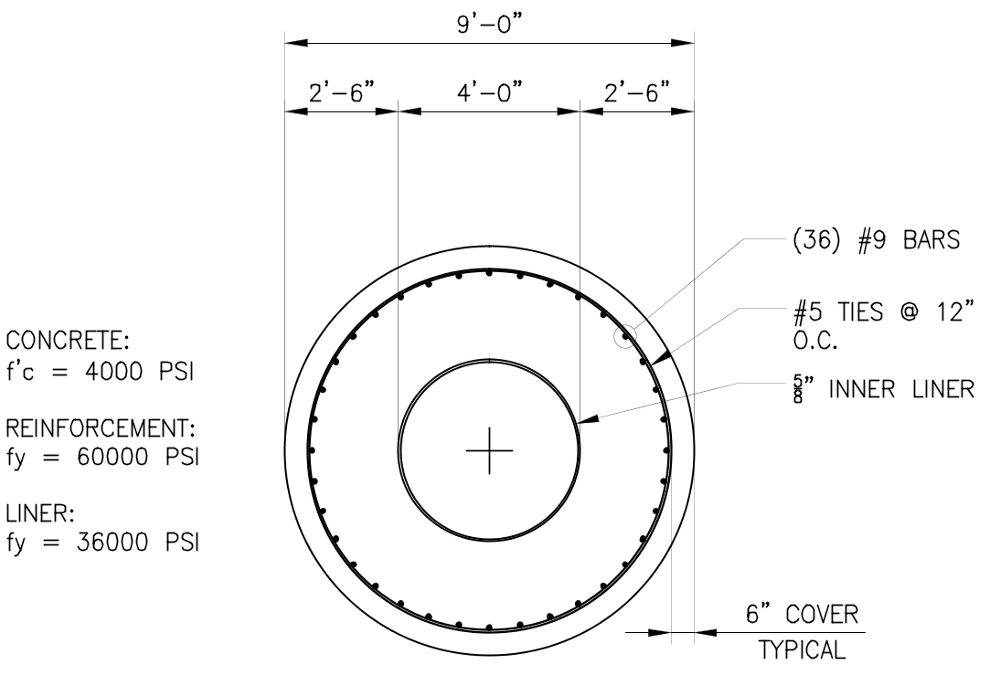
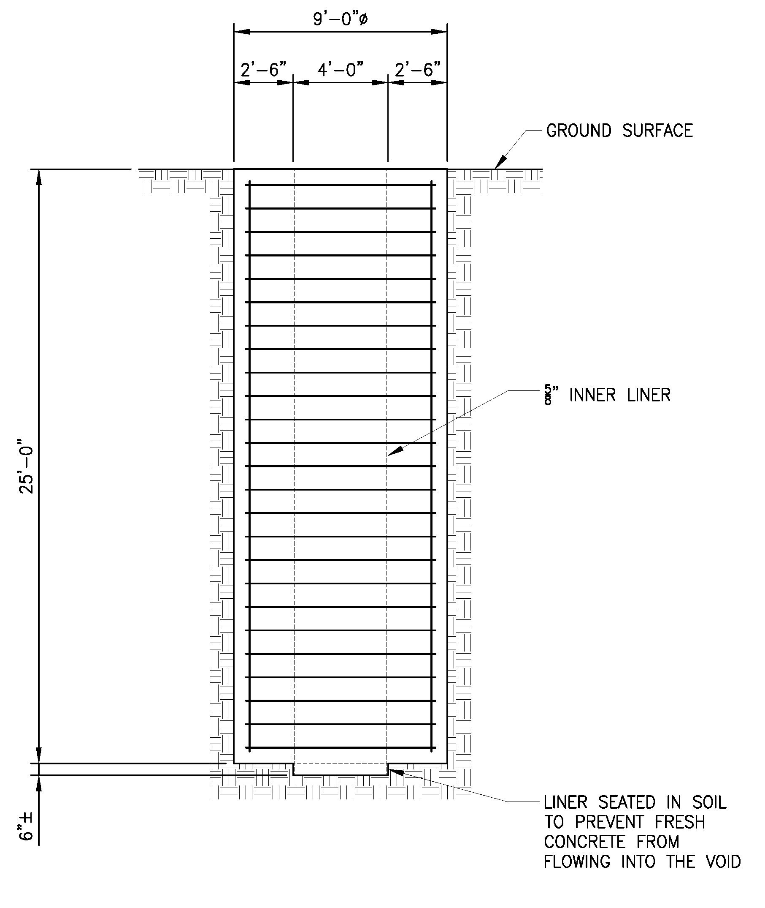
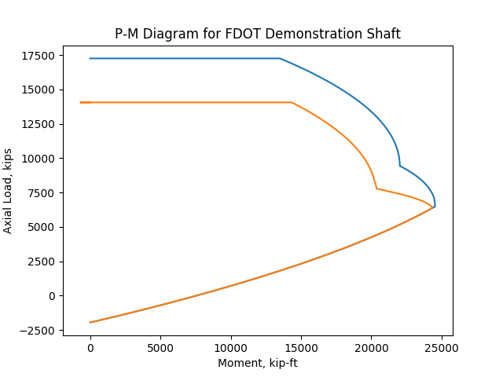
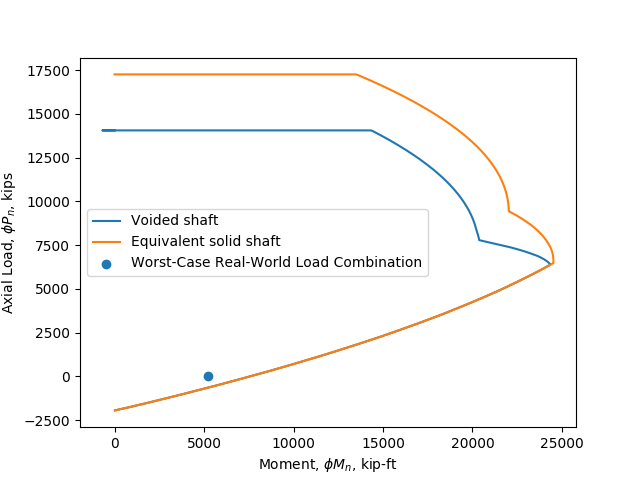

% Voided Shafts for Transmission Line Foundations -- Feasibility Study
% Joe Legner, P.E., S.E.[^1]
% November 10, 2019

[^1]: Author is licensed as a Structural Engineer in Illinois and a Professional Engineer in both Florida and Massachusetts.

# Background

Transmission structures are used to elevate electric power lines to a safe distance above ground. The height exposes them to wind, and the attached power lines exert lateral forces that have long moment arms up to 150 feet. The combined effects of the wires and wind is an overturning moment which is termed the _groundline moment_. The long moment arm and horizontal direction of load application results in foundation reactions with high moment, low axial load, and low to moderate shear load.

Transmission structures can consist of latticed towers, H-structures with two or three vertical poles connected at the top, and even imaginitive structures like the Mickey Mouse shaped Mickey Pylon near Walt Disney World in Orlando, Florida. But the most common type being installed in the United States today is the monopole. Monopoles can be constructed using concrete or steel. Concrete monopoles are installed by the age-old method of direct embedment into the soil, with optional concrete backfill. Steel monopoles can be directly buried, too; however, large steel monopoles that develop too high of a groundline moment for direct burial are built with drilled shaft foundations.

Drilled shafts are deep foundations constructed by drilling a circular hole with an auger and filling the hole with concrete. The shaft is usually reinforced with a cage of vertical bars and hoops. Anchor bolts are embedded in the top of the shaft to connect the tranmission line structure to it. Drilled shafts for transmission line structures typically range between about 2 and 10 feet in diameter (IEEE 2001). Even larger diameters have been constructed. The shaft proportions are usually governed by geotechnical soil capacity, but can also be dictated by the anchor bolt circle diameter and required edge distance.

Some drilled shaft designs become large enough in diameter that they must be treated as mass concrete. The Florida Department of Transportation (FDOT) requires that concrete be classified as mass concrete when the shaft exceeds 6 feet in diameter (FDOT 2018). Mass concrete carries with it the risk of a deleterious phenomenon called Delayed Ettringite Formation (DEF) that can cause severe cracking.

## Delayed Ettringite Formation (DEF)

DEF is a process by which the mineral ettringite forms expansively in the hardened concrete matrix and cracks the shaft. High hydration temperatures destroy the ettringite that forms normally early in the curing process (Mindess and Young 2002). When the temperature finally falls below a threshold level, and if moisture is present, the ettringite re-forms in an expansive reaction. This causes tensile stresses that crack the hardened concrete. The threshold temperature is still a matter of debate. Values range from about 160$^\circ$F (Mindess and Young) to 180$^\circ$F (FDOT).

{ width=3.5in }

The traditional methods of mitigating the effects of mass concrete temperatures include reducing cross-sections, specifying mix designs that develop lower heat of hydration, and batching concrete using ice. Reducing the cross-section works by reducing the amount of concrete producing heat. The other two methods tend to rely on retarding the hydration reaction to reduce the amount of heat produced.

Since transmission line structure drilled shaft diameter size is usually dictated by either geotechnical or anchor bolt edge distance requirements, reducing the cross-section is rarely an option. The low heat of hydration techniques are also problematic, because methods that delay curing also extend the length of the project, delaying the in-service date and increasing project costs. It would be better to find a way to construct large drilled shafts using conventional concrete without running the risk of DEF.

## Voided Shafts for Temperature Control

Johnson and Mullins (2007) devised a mitigation concept they term "voided shaft" which is to cast a continuous void through the centerline of the pier. This reduces the overall quantity of heat-producing concrete and provides a second surface by which to dissipate heat from the shaft into the environment. Their 3D numerical modeling showed in theory that the method is capable of keeping temperatures below the threshold for DEF concern. Preliminary structural analysis showed that moment capacity would not be reduced significantly. Although axial capacity would be significantly reduced, this is not generally a concern for transmission line structure foundations. Additionally Johnson and Mullins showed that a voided shaft even has the potential to reduce costs.

To further investigate the voided shaft idea, FDOT sponsored a demonstration shaft, 9 feet in diameter with a 4-foot diameter central void (Mullins, Johnson, and Winters 2018). It used an FDOT Class IV concrete mixture ($f'_c = 4000\text{ psi}$) and was reinforced with 36-#9 bars and #5 hoops. The demonstration shaft was successfully constructed and was found to reduce the peak concrete temperature below the threshold for DEF.

We will next look closer at structural design considerations for the voided shaft concept.

# Structural Design

There is no unified code for transmission structure foundation design. Kandaris and Davidow (2015) polled practicing engineers and found that 89 percent use the ACI 318 code for concrete design, four times as many as use the next code. We will therefore adopt the ACI 318 code for concrete design. References to ACI 318 hereafter are to the ACI 318-14 code specifically.

## Code Review

ACI 318 Section 1.4.6 and Section 13.1.2 exclude drilled shafts -- called "drilled piers" in ACI standards -- from the code, except in two cases:

1. Where shafts are laterally unsupported such as in water; and,

1. For structures in Seismic Design Categories D, E, and F.

Chapter 13 of the code gives foundation design requirements. However, detailed requirements for drilled shafts are not given. Refer to Section 13.4.3.

Chapter 14 of the ACI 318 code deals with plain concrete. Section 14.1.2 specifically excludes drilled shafts and refers the user to the general building code. In some states, including Florida, transmission line structures are excluded from the building code requirements, leaving us with no code for the design of such foundations.

ACI 336.3-93 is outdated but recommends using the ACI 318 code for concrete design for drilled shafts, in contradiction to the ACI 318 code itself. It also recommends that ACI 318.1, which was previously a parallel code for plain concrete, be used for the design of piers with sufficient lateral resistance of soil provided, again in contradiction to the ACI 318 code.

## Confinement

Confinement increases the compressive strength of concrete and maximizes the strength contribution of longitudinal steel reinforcing bars to the strength of the foundation by preventing the steel from buckling out the side of the shaft. The ACI code allows the use of either spiral reinforcement or circular hoops for confinement. _Solid_ drilled shafts are confined using hoops. But _hollow_ confinement is not as straightforward. The exterior face of the column is confined with ordinary hoops, but it is also possible for the longitudinal bars to buckle toward the interior face of a hollow section. A variety of approaches are used for hollow sections:

1. Provide a single mat of bars near the outside face and do not confine the inside face of the section. This can be effective for structures where the interior face never experiences strains sufficient to cause a sudden, brittle concrete failure.

2. Provide a second mat of bars on the inside face. Cross hoops are provided to connect the two mats (Liang et. al. 2015).

3. Confine the inside face using a hollow steel section (Liang et. al. 2015).

Liang, Beck, and Sritharan (2015) investigated single- and double-mats for the California Department of Transportation and found that double mats are the most effective. However, this was for shafts supporting bridges, which are likely to be subjected to significant axial loads. For repetitive transmission line structures without significant axial or shear load, the added expense of the second mat and cross hoops should be avoided if possible.

The Johnson and Mullins test shaft employed an inner permanent casing. Such a casing can in principle prevent the axial bars from buckling inward, thereby increasing the potential axial and flexural capacity of the voided shaft. Han, Yoon, and Kang (2010) tested the idea of using an internal steel tube and found that the internal tube did indeed result in confinement that is sufficient for the longitudinal bars to be relied upon for strength in the compression region of the section.

## Structural Design Overview

Structural design of transmission line foundation piers requires consideration of (1) axial and flexural strength and (2) shear and torsion. Capacity reduction factors are given in ACI Table 21.2.1. For combined flexure and axial load the capacity reduction factor ranges between 0.65 and 0.90 depending on whether the section is compression-controlled or tension-controlled. For shear and torsion, $\phi = 0.75$.

## Axial and Flexural

Flexure is the primary loading that needs to be resisted by transmission line structure drilled shaft foundations. Even though $P_u$ is likely to be small compared to $M_u$, ACI 318 Section 10.4.2.1 requires that the designer consider $P_u$ and $M_u$ simultaneously for each load combination. The standard design method is to prepare an interaction diagram as depicted in ACI 318 Figure R10.4.2.1 and plot each load combination point ($M_u$, $P_u$) on the diagram. If all points fall inside the boundary, the column meets code requirements for axial load and flexure.

Minimum steel is required for the column. Minimum reinforcement for columns is specified in ACI 318 Section 10.6.1.1 as 1% of the gross area of the member: $A_{s,min} = 0.01A_g$. However, because the proportions of a drilled shaft are governed by either the geotechnical soil requirements or anchor bolt circle minimum edge distance requirements, ACI 318 Section 10.3.1.2 allows us to use one-half the gross cross-sectional area for minimum steel calculations. Therefore minimum steel is:

$$A_{s,min} = 0.005 A_g$$

Where:

$$A_g = \dfrac{ \pi (D^2 - D_i^2) }{4} $$

Transverse reinforcement (hoops) is required to be provided for bars in axial compression, and Section 25.7.2 provides the requirements. The two requirements that are likely to control drilled shaft foundations are that $s \leq 16d_b$ of the longitudinal bar and $s \leq 48d_b$ of the tie bar size. Additional hoops at the top of the pier are required by ACI 318 Section 10.7.6.1.6. They shall be at least two #4 bars within the top 5 inches of the drilled shaft.

For combined axial and flexure $\phi$ depends on whether the section is classified as compression-controlled and tension-controlled. There is also a transition region between the two where $\phi$ varies linearly. For deformed bars, $\epsilon_{ty} = f_y/E_s = 0.00207$ for Grade 60 bars as assumed here.

{ width=3.5in }

Strength is checked using an interaction diagram, sometimes referred to as a "P-M Diagram." Such a diagram is calculated by varying the strain distribution across the section, holding $\epsilon_c=0.003$. The value of $\phi$ is determined at every point on the diagram by categorizing the point as being compression-controlled, tension-controlled, or the transition region between the two. CRSI (2008) provides examples of such calculations. A computer program written in the Python programming language was used to compute P-M diagrams for this paper. The program was validated against the manual example on pages 4-5 to 4-7 of the 2008 CRSI Handbook.

{ width=5in }

The longitudinal bars in a drilled shaft with internal casing are confined against buckling into the void (Han, Yoon, and Kang 2010). The longitudinal bars in the compression zone of column section will therefore contribute to the strength.

The concrete shaft and its interior casing could be designed as a composite member to maximize the design capacity. ACI 318 Commentary Section R10.5.2.2 references the AISC Steel Construction Manual (2010) for composite sections. Chapter I of the AISC manual governs the design of composite members and provides design requirements for two kinds of composite columns: encased shapes (Section 4a) and filled composite members (Seciton 4b). To qualify as an encased composite shape requires that the load transfer region be furnished with steel anchors. For transmission line structures, the added cost and labor to attach steel anchors to the interior casing would not be justified. Sufficient strength is achievable in the concrete section without designing it as a composite member. Future research might explore this concept further.

## Shear and Torsion

The ACI 318 code does not address the shear capacity of hollow circular sections. ACI 371R-08 (2008) gives shear capacity recommendations for the hollow circular concrete pedestals of concrete water towers. ACI 371R does not state whether it assumes a two-mat with cross-tie reinforcing bar arrangement. It is assumed that even if this is the assumption, the internal casing will provide sufficient confinement to justify using the ACI 371R shear capacity recommendations.

If we consider the water tower pedestals to be sufficiently similar to the hollow drilled shaft foundations, we can use ACI 371R to calculate the area of concrete effective in shear, $A_{cv}$:

$$A_{cv} = \left( 2 - \psi \right)b_v t$$

$$\psi = \dfrac{b_x}{b_v}$$

$$b_v \leq 0.78D$$

{ width=6in }

We can simplify the equations by recognizing that transmission line structure drilled shafts will never have an opening, so $b_x = 0$, $\psi = 0$, and hence:

$$A_{cv} = 2b_v t$$

The formula for nominal shear strength from Section 5.2.2.7.6 of ACI 371R is:

$$V_n = \left( a_c \sqrt{f'_c} + \rho_h f_y \right)A_{cv}$$

$$a_c = 6 - \dfrac{2.5M_u}{V_u d_w}$$

Where $a_c$ is constrained to fall between 2 and 3:
$$2 \leq a_c \leq 3$$

Neglecting the reinforcing ratio of the hoops, $\rho_h = 0$. We can also conservatively take $a_c$ to be the lower limit, $a_c = 2$ and let $t = (D - D_i)/2$, and $b_v = 0.78D$. Substituting all of these values into the formula for $V_n$ gives:

$$\boxed{V_n = 3.12 \sqrt{f'_c} D \dfrac{\left( D - D_i \right)}{2}}$$

For shear, $\phi = 0.75$.

# Numerical Example

To elaborate on the work of Johnson and Mullins (2007) we will look at a numerical example based on the same shaft design that was constructed by FDOT (Mullins, Johnson, and Winters 2018). It is referred to herein as the "FDOT Demonstration Shaft."

{ width=4in }

{ width=5in }

## Given











1. Drilled shaft oustide diameter, $D = {{D|s}}$ in.

1. Drilled shaft inside diameter (internal liner outside diameter), $D_i = {{Di|s}}$ in.

1. Concrete compressive strength, $f'_c = {{fc|s}}$ psi. Therefore, $\beta_1 = 0.85$

1. Steel yield stress, $f_y ={{fy|s}}$ psi.

1. Longitudinal bars consist of 36-#9 bars, $A_{st} = 36 \times {{Ab|f3}} = {{Ast|s}}\text{ in}^2$.

1. Ties are #5 at {{s|i}} inches on center.

## Assumptions

1. Drilled shaft is laterally restrained by soil and does not need to be designed in accordance with ACI 318 Chapter 10 per Section 13.4.3.1.

1. Concrete is normal weight.

1. Hoops confine bars against outward buckling and internal casing confines bars against inward buckling. Longitudinal bars are therefore considered effective in compression.

1. Internal casing does not behave in a composite manner.

1. Structure is in Seismic Design Category A, B, or C. (Seismic is beyond the scope of this paper.)

## Combined Axial and Flexure

By ACI 318 definition, the gross are of the drilled shaft excludes the void area:


$$A_g = \dfrac{ \pi \left( D^2 - D_i^2 \right) }{4} = \dfrac{ \pi \left( {{D|s}}^2 - {{Di|s}}^2 \right) }{4} = {{Ag|s}}\text{ in}^2$$

The maximum compressive strength for a tied column according to ACI 318 Section 22.4.2:
 
$$P_{n,max} = 0.80 \left[ 0.85 f'_c \left( A_g - A_{st} \right) + f_y A_{st}    \right]$$
$$P_{n,max} = 0.80 \left[ 0.85 \times {{fc|s}} \left( {{Ag|s}} - {{Ast|s}} \right) + {{fy|s}} \times {{Ast|s}}   \right] /1000 = {{Pnmax|s}}\text{ kips}$$
$$\phi P_{n,max} = 0.65 \times {{Pnmax|s}} = {{phiPnmax|s}}\text{ kips}$$

## Shear




The nominal shear capacity of the demonstration shaft is:
$$V_n = 3.12 \sqrt{ {{fc|s}}  } ({{D|s}})\dfrac{({{D|s}} - {{Di|s}})}{2}/1000 = {{Vn|s}}\text{ kips}$$
$$\phi V_n = {{phiv|f}} \times {{Vn|s}} = {{phiVn|s}}\text{ kips}$$

Shear reinforcement is required by ACI Section 10.6.2.1 when $V_u \geq 0.5 \phi V_c$.

Interaction diagram produced by Python computer program:

{ width=5in }

## Comparison to Real-World Design







We will now compare the capacity of the FDOT Demonstration Shaft to a real-world transmission line structure. The subject structure is being constructed by the local regulated electric utility in Apollo Beach, Florida as part of a transmission line project. The structure's anchor bolt cage has a bolt circle diameter of 7 feet. The foundation engineer selected a shaft diameter of 9 feet to provide an adequate anchor bolt edge distance. This is coincidentally the same shaft diameter as the FDOT Demonstration Shaft. Reinforcement of the real-world shaft is 30-#11 bars, so $A_{st} = {{n}} \times {{Ab|s}} = {{Ast|s}}\text{ in}^2$ or {{Ast_increase|i}}% greater than the FDOT Demonstration Shaft. The reason is that $A_g$ for the solid shaft exceeds $A_g$ for the voided shaft.

{ width=5in }

The _factored_ loads applied to the foundation were provided by the monopole structure design engineer:







-   Shear force, $V_u = {{Vu|s}}$ kips.
-   Applied groundline moment, $M_g = {{Mg|s}}$ kip-ft.
-   Maximum moment in the shaft, $M_u = {{Mu|s}}$ kip-ft at a depth of {{z|s}} ft below the ground surface per LPile analysis.
-   Vertical download load, $P_u = {{Pu|s}}$ kips.

First, we will check shear:
$$\phi V_n = {{phiVn|s}} > {{Vu|s}}\text{ kips - OK}$$

No shear reinforcement is required.

To check combined axial load and flexure in accordance with ACI 318 Section 10.4.2.1, we will plot the point ($M_u$, $P_u$) on the voided shaft's interaction diagram: ({{Mu|s}}, {{Pu|s}}).

{ width=5in }

The load combination falls within the interaction envelope of the voided shaft foundation. This means the voided shaft concept can feasibly safely support a real-world transmission line structure, further validating the concept.

# Structural Capacity Testing (TODO)

# Cost Comparison (TODO)

# Conclusions

The concept of using a hollow or "voided" drilled shaft foundation seems to be feasible with respect to mitigating concern over DEF, constructability, structural capacity, and economy. A voided shaft was shown to have ample capacity to resist realistic transmission line structure reactions with only minimum 0.5% longitudinal steel and one layer of hoops. Further investigation is needed to address anchor bolts and seismic design. Beneficial use of the internal casing in a composite manner could be considered.

# Symbols Used

$a$ = depth of rectangular (Whitney) stress block, in.

$A_b$ = area of individual bar, $\text{in.}^2$.

$A_{cv}$ = effective shear area of concrete $\text{in.}^2$

$A_g$ = gross area of concrete section which excludes the void area, $\text{in.}^2$.

$A_s$ = area of nonprestressed longitudinal reinforcement, $\text{in.}^2$.

$A_s'$ = area of compression reinforcement, $\text{in.}^2$.

$A_{s,min}$ = minimum area of reinforcement, $\text{in.}^2$.

$A_t$ = area of one leg of a hoop, $\text{in.}^2$.

$b$ = width of compression member, in.

$b_v$ = length of effective shear wall circumference of shaft = $0.78D$ in. for transmission line structure foundations.

$b_x$ = length of opening along circumference of shaft = 0 in. for transmission line structure foundations.

$c$ = distance from extreme compression fiber to neutral axis, in.

$d$ = distance from extreme compression fiber to centroid of longitudinal tension reinforcement, in.

$d'$ = distance from extreme compression fiber to centroid of longitudinal compression reinforcement, in.

$d_b$ = diameter of bar, in.

$D$ = outside diameter of concrete, in.

$D_i$ = inside diameter of concrete = outside diameter of casing, in.

$E_c$ = modulus of elasticity of concrete, psi.

$E_s$ = modulus of elasticity of steel = 29000000 psi.

$f'_c$ = specified compressive strength of concrete, psi.

$\sqrt{f'_c}$ = square root of specified compressive strength of concrete, psi.

$f_y$ = yield strength for nonprestressed reinforcement, psi.

$f_{yt}$ = yield strength for nonprestressed reinforcement hoops, psi.

$M_n$ = nominal flexural strength at section, kip-ft.

$M_u$ = factored moment at section, kip-ft.

$n$ = number of items such as longitudinal reinforcing bars.

$P_n$ = nominal axial compressive strength of member, kips.

$P_u$ = factored axial force to be taken as positive for compression and negative for tension, kips.

$s$ = center to center spacing of items such as hoops, in.

$t$ = wall thickness of hollow section = $(D - D_i)/2$, in.

$T_c$ = nominal torsion strength provided by concrete, kips.

$T_n$ = nominal torsion strength provided by section, kips.

$T_s$ = nominal torsion strength provided by steel, kips.

$T_u$ = factored torsion force at section, kips.

$V_c$ = nominal shear strength provided by concrete, kips.

$V_n$ = nominal shear strength provided by section, kips.

$V_s$ = nominal shear strength provided by steel, kips.

$V_u$ = factored shear force at section, kips.

$\beta_1$ = factor relating depth of equivalent rectangular compressive stress block to depth of neutral axis.

$\epsilon_t$ = net tensile strain in extreme layer of longitudinal tension reinforcement at nominal strength.

$\epsilon_{ty}$ = value of net tensile strain in the extreme layer of longitudinal tension reinforcement used to define a compression-controlled section.

$\rho$ = ratio of longitudinal steel $A_s$ to $bd$.

$\rho_h$ = ratio of hoops $A_{st}$ to $bd$.

$\phi$ = strength reduction factor.

$\psi$ = factor from ACI 371R-08 effective shear area formula.

# References

American Concrete Institute, _Building Code Requirements for Structural Concrete_, ACI 318-14, 2014.

American Concrete Institute, _Design and Construction of Drilled Piers_, ACI 336-93 (Reapproved 2006), 1993.

American Concrete Institute, _Guide for the Analysis, Design, and Construction of Elevated Concrete and Composite Steel-Concrete Water Storage Tanks_, ACI 371R-08, 2008.

American Institute of Steel Construction, _Specification for Structural Steel Buildings_, AISC 360-10, June 22, 2010.

Concrete Reinforcing Steel Institute, _CRSI Design Handbook_, CRSI, 2008.

Florida Department of Transportation, _Structures Design Guidelines_, SDG, FDOT, Structures Manual Volume 1, January 2018.

Han, T. H., Yoon, K. Y., & Kang, Y. J., "Compressive strength of circular hollow reinforced concrete confined by an internal steel tube," Construction and Building Materials, V. 24, No. 9, 2010, pp. 1690–1699.

Institute of Electrical and Electronics Engineers, _IEEE Guide for Transmission Structure Foundation Design and Testing_, IEEE Std 691-2001, p. 80.

Jensen, Uffe G ; Hoang, Linh Cao, "Shear Strength of Reinforced Concrete Piers and Piles with Hollow Circular Cross Section", Structural Engineering International, V. 20, No. 3. 2010, pp. 260-267.

Johnson, K. M. and Mullins, G., "Concrete Temperature Control via Voiding Drilled Shafts," _Contemporary Issues in Deep Foundations_, ASCE Geo Institute, GSP, V. I, No. 158, 2007, pp. 1-12.

Kandaris, P. M. and Davidow, S., "Study of Electric Transmission Line Deep Foundation Design," Electrical Transmission and Substation Structures 2015, ASCE, pp. 577-587.

Liang, Xiao; Beck, Ryan and Sritharan, Sri, "Understanding the Confined Concrete Behavior on the Response of Hollow Bridge Columns," California Department of Transportation Caltrans Project Contract: 65A0412, January 2015.

Mindess, Sidney; Young, J. Francis; and Darwin, David, _Concrete_, Second Edition, Prentice Hall, 2002, p. 490.

Mullins, G.; Johnson, Kevin R. and Winters, D., "Controlling Mass Concrete Effects in Large-Diameter Drilled Shafts Using Full-Length Central Void," _ACI Structural Journal_, American Concrete Institute, V. 115, No. 5, September 2018, pp. 1-10.
