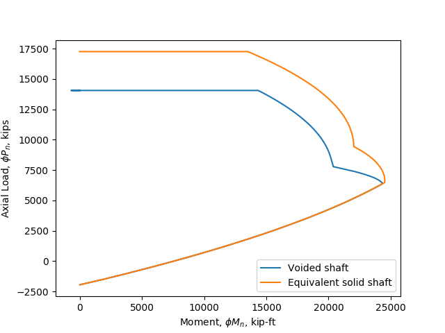

% Voided Shafts for Transmission Structure Foundations -- Feasibility Study
% Joe Legner, P.E., S.E.
% November 4, 2019

# Introduction

Transmission structures are used to elevate electric power lines to a safe distance above ground. The height exposes them to wind. In addition to wind, the power lines exert lateral forces. The combined effects of the wires and wind is an overturning moment which is termed _groundline moment_. Transmission structures can consist of latticed towers, structures with two or three vertical poles connected at the top, and even imaginitive structures like the Mickey Mouse shaped Mickey Pylon near Walt Disney World in Orlando, Florida, but the most common type being installed in the United States today is the monopole. Monopoles can be constructed using concrete or steel. Concrete monopoles are installed by the age-old method of direct burial. Steel monopoles can be directly buried, too. But large steel monopoles that develop too high of a groundline moment for direct burial are built with drilled shaft foundations.

Drilled shafts are deep foundations constructed by drilling a circular hole with an auger and filling the hole with concrete. The shaft is reinforced with a cage of vertical bars and ties. Drilled shafts can be large enough in diameter that they behave as mass concrete. With this comes the risk of a phenomenon called Delayed Ettringite Formation (DEF). DEF is a process by which the mineral ettringite forms after hardening is substantially complete. It does not involve sulfate from outside the cement paste -- a related process called _sulfate attack_. High hydration temperatures in mass concrete prevent the normal initial ettringite formation from occurring. As the hydration progresses and the temperature drops below a threshold, ettringite is able to start forming. Its expansive reaction develops tensile loads in the concrete which cause cracking damage and can lead to serviceability problems and structural failures.

{ width=4in }

## Transmission Line Structure Foundations

Drilled shafts for transmission line structures typically range between about 2.5 feet and 10 feet in diameter (IEEE 2001). Even larger diameters have been constructed. The diameter of a shaft may be dictated by the anchor bolt circle diameter and required edge distance rather than by geotechnical concerns. At the larger end of the range, DEF is a real concern. Loads from wind and wires tend to be overturning and shear forces with small axial components than bridge shafts.

Applications in the power industry / typical loads and shaft diameters presently and where voided shafts could be used.

## Mitigation Techniques

The traditional methods of mitigating the effects of mass concrete temperatures include reducing cross-sections and employing mix designs that develop lower heat of hydration.

# Background

## Previous Work on Voided Shafts

Mitigating the concern with low heat of hydration techniques is problematic, because the delayed curing also extends the length of the project, delaying completion and increasing project carrying costs. It would be better to find a way to construct large drilled shafts using conventional concrete or even high early strength mixes without DEF.

Johnson and Mullins (2007) devised a mitigation concept which is to cast a continuous void through the centerline of the pier. This reduces the overall quantity of heat-generating concrete and provides a second surface through which to dissipate heat from the shaft into the environment. Their 3D numerical modeling shows voiding shafts is capable of keeping temperatures below the threshold for DEF concern. Their preliminary structural analysis shows that moment capacity would not be reduced significantly. Although axial capacity would be significantly reduced, this is not generally a concern for transmission line foundations. Additionally Johnson and Mullins show that a cost savings might be had by using the technique -- an added benefit.

To further investigate the voided shaft idea, the Florida Department of Transportation (FDOT) sponsored a demonstration shaft, 9 feet in diameter with a 4-foot diameter central void (Mullins, Johnson, and Winters 2018). It used an FDOT Class IV concrete mixture ($f'_c = 4000\text{ psi}$) reinforced with 36 #9 bars and #5 stirrups. The demonstration project validated the constructibility of the concept.

Background of the voided shaft concept and past demonstration project.

Possible structural code issues (is there a maximum internal cover thickness, does it need a central cage as well as the normal age?)

Methods of verification, testing. Things that a test may test: soil behavior, structural bending and shear resistance. Limits nt test configurations: may test soil well but does not impose the correct bending moment in the element. Power poles are weird,nt, moderate to high lateral forces, low axial load

Maybe a cost comparison: I recently got a quote for a cooling system for 7ft diameter, 25ft long shaft at \$25k. So, savings can be not only concrete removed vs. the cost of a permanent central casing.

# Structural Design

## Confinement Considerations

Structural design of transmission line foundation piers requires consideration of (1) flexure, (2) axial load, and (3) shear and torsion. Because of the nature of transmission line structure loads, axial and shear loads are small relative to bridge foundations, for example. Flexure is the primary loading that needs to be resisted.

Confinement increase the strength of concrete and maximizes the strength contribution of longitudinal steel reinforcing bars to the strength of the foundation by preventing the steel from buckling out the side of the shaft. The ACI code allows the use of either spiral reinforcement or circular ties for confinements. Solid circular drilled shafts are confined using ties. But hollow cylindrical column confinement is not as straightforward. The outer face of the column is confined with ordinary ties. However, it is also possible for the inside face of a hollow section to fail. To prevent such a failure, a variety of approaches have been considered in the literature:

1. Provide a single mat of bars near the outside face and do not confine the inside face of the section.

2. Provide a second mat of bars, including ties, on the inside face. Cross-ties are provided to connect the two mats (Liang et. al. 2015).

3. Confine the inside face using a hollow steel section (Liang et. al. 2015).

Liang, Beck, and Sritharan (2015) investigated single- and double-mats for the California Department of Transportation (CalTrans) and found that double mats are the most effective. However, this was for bridges which have a significant axial load and shear loads in earthquake-prone regions like California. For reptitive transmission structures without significant axial or shear load, the added expense of the second mat and cross-ties should be avoided if possible.

Test results show that the single mat of bars near the outside face is liable to fail by buckling of the axial bars toward the inner void.

Double mats are effective at preventing the axial bars from buckling inward.

The construction method employed in the Johnson and Mullins test shaft employed an inner permanent casing. Such a casing could prevent the axial bars from buckling inward, thereby increasing the potential axial and flexural capacity of the voided shaft. Inner steel tube confines axial bars (Han 2010).

{ width=4in }

{ width=4in }

{ width=5in }

## Code Review

There is no unified code for transmission structure foundation design. Kandaris and Davidow (2015) polled practicing engineers and found that 89 percent use the ACI 318 code for concrete design, four times as many as use the next code. This study adopts the ACI 318-14 code for concrete design which appears to be as close to industry standard practice as we can determine.

ACI 318 Section 1.4.6 and Section 13.1.2 exclude drilled shafts ("drilled piers" in ACI) from the code, except in two cases:

1. Where shafts are laterally unsupported such as in water; and,

1. For structures in Seismic Design Categories D, E, and F.

Chapter 13 of the code gives foundation design requirements. However, detailed requirements for drilled shafts are not given. Refer to Section 13.4.3.

Chapter 14 of the ACI 318 code deals with plain concrete. Section 14.1.2 specifically excludes drilled shafts and refers the user to the general building code. In some states, including Florida, transmission line structures are excluded from the building code requirements, leaving us with no code for the design of such foundations.

ACI 336.3-93 is outdated but recommends using the ACI 318 code for concrete design for drilled shafts, in contradiction to the ACI 318 code itself. It also recommends that ACI 318.1, which was previously a parallel code for plain concrete, be used for the design of piers with sufficient lateral resistance of soil provided, again in contradiction to the ACI 318 code.

## Structural Design Requirements

Assumptions:

1. Drilled shaft is laterally restrained by soil and does not need to be designed in accordance with ACI 318 Chapter 10 per Section 13.4.3.1.

1. Specified compressive strength of concrete $$ 3000\text{ psi} \leq f'\_c \leq 4000 \text{ psi} $$. $$\beta_1 = 0.85 $$

1. Concrete is normal weight.

1. ASTM A615, grade 60 deformed bars for ties and axial reinforcement: $$ f_y = 60000\text{ psi} $$.

1. The inner tube behaves as a composite member.

Minimum steel is required for the column. Minimum reinforcement is specified in ACI 318 Section 10.6.1.1 as 1% of the gross area of the member: $A_{s,min} = 0.01A_g$. However, because the proportions of a drilled shaft are governed by either the geotechnical soil requirements or anchor bolt circle minimum edge distance requirements, ACI 318 Section 10.3.1.2 allows us to use one-half the gross cross-sectional area for minimum steel calculations. Therefore minimum steel is:

$$ A_{s,min} = 0.005 A_g = \dfrac{ \pi (D^2 - D_i^2) }{4} $$

The required inner tube thickness is controlled by ACI Section 10.3.1.6.

$$ t_{min} = D \sqrt{\dfrac{fy}{8E_s}} $$

Design equations per ACI Section 10.5.1.1:

$$ \phi P_n \geq P_u $$

$$ \phi M_n \geq M_u $$

$$ \phi V_n \geq V_u $$

$$ \phi T_n \geq T_u $$

$P_n$ and $M_n$ are calculated in accorance with ACI 318 Section 21.2.

The concrete shaft and its inner liner could be designed as a composite member to maximize the design capacity. ACI 318 Commentary Section R10.5.2.2 references the AISC Steel Construction Manual (2010) for composite sections. Chapter I of the AISC manual governs the design of composite members and provides design requirements for two kinds of composite columns: encased shapes (Section 4a) and filled composite members (Seciton 4b). To qualify as an encased composite shape requires that the load transfer region be furnished with steel anchors. For transmission line structures, the added cost and labor to attach steel anchors to the inner liner would not be justified. Sufficient strength is achievable in the concrete section without designing it as a composite member.

Shear reinforcement is required by ACI Section 10.6.2.1 when $V_u \geq 0.5 \phi V_c$.

Transverse reinforcement is required to be provided for bars in axial compression. Section 25.7.2 provides the requirements. The two requirements that are likely to control drilled shaft foundations are that $s \leq 16d_b$ of the longitudinal bar and $s \leq 48d_b$ of the tie bar size.

Additional ties at the top of the pier are required by ACI 318 Section 10.7.6.1.6. They shall be at least two #4 bars within the top 5 inches of the drilled shaft.

# Cost Comparison

# References

American Concrete Institute, _Building Code Requirements for Structural Concrete_, ACI 318-14, 2014.

American Concrete Institute, _Design and Construction of Drilled Piers_, ACI 336-93 (Reapproved 2006), 1993.

American Institute of Steel Construction, _Specification for Structural Steel Buildings_, AISC 360-10, June 22, 2010.

Han, T. H., Yoon, K. Y., & Kang, Y. J., "Compressive strength of circular hollow reinforced concrete confined by an internal steel tube," Construction and Building Materials, V. 24, No. 9, 2010, pp. 1690–1699.

Jensen, Uffe G ; Hoang, Linh Cao, "Shear Strength of Reinforced Concrete Piers and Piles with Hollow Circular Cross Section", Structural Engineering International, V. 20, No. 3. 2010, pp. 260-267.

Johnson, K. M. and Mullins, G., "Concrete Temperature Control via Voiding Drilled Shafts," _Contemporary Issues in Deep Foundations_, ASCE Geo Institute, GSP, V. I, No. 158, 2007, pp. 1-12.

Kandaris, P. M. and Davidow, S., "Study of Electric Transmission Line Deep Foundation Design," Electrical Transmission and Substation Structures 2015, ASCE, pp. 577-587.

Liang, Xiao; Beck, Ryan and Sritharan, Sri, "Understanding the Confined Concrete Behavior on the Response of Hollow Bridge Columns," California Department of Transportation Caltrans Project Contract: 65A0412, January 2015.

Mullins, G.; Johnson, Kevin R. and Winters, D., "Controlling Mass Concrete Effects in Large-Diameter Drilled Shafts Using Full-Length Central Void," _ACI Structural Journal_, American Concrete Institute, V. 115, No. 5, September 2018, pp. 1-10.
